# Penetration Test Report: Apache Web Services Reconnaissance

**Date:** August 25, 2025  
**Target:** Metasploitable 2 (192.168.56.101)  
**Attacker:** Parrot OS (192.168.56.102)  
**Focus:** Web Service Enumeration & Vulnerability Assessment  
**Campaign:** Day 6 of 20 - Advanced Penetration Testing Series

---

## Executive Summary

A comprehensive reconnaissance of the Apache web server on the target machine revealed multiple critical vulnerabilities, including outdated software versions, exposed sensitive information, and misconfigured services. The assessment identified several high-risk entry points for potential exploitation, such as phpMyAdmin, DVWA, and TWiki, all of which are known to be vulnerable if not properly secured.

---

## Reconnaissance Objectives

1. Identify open web ports (80, 443)
2. Enumerate web directories and applications
3. Discover version-specific vulnerabilities  
4. Identify misconfigurations and information leaks

---

## Tools and Methodology

- **Nmap**: Port scanning and service detection
- **Nikto**: Web vulnerability scanner
- **Gobuster**: Directory and file brute-forcing
- **Manual Inspection**: Analysis of web applications

---

## Technical Reconnaissance Process

### Step 1: Initial Port Scanning with Nmap

Conducted comprehensive service detection on standard web ports:

```bash
nmap -sV -sC -p 80,443 -oA apache_scan 192.168.56.101
```

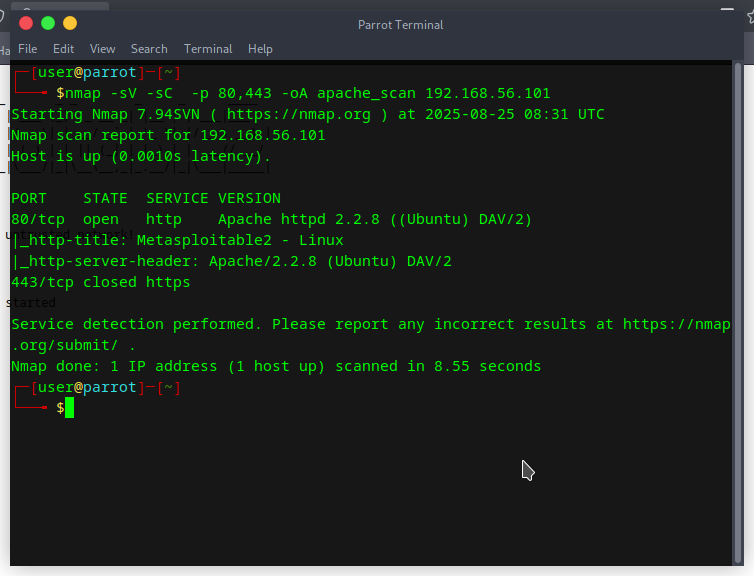
*Initial Nmap scan revealing Apache service details*

**Key Findings:**
- Port 80: Apache httpd 2.2.8 (Ubuntu) with WebDAV enabled
- Port 443: Closed
- Server header: `Apache/2.2.8 (Ubuntu) DAV/2`
- Page title: "Metasploitable2 - Linux"

### Step 2: Web Application Discovery

Manual browsing revealed the default Metasploitable landing page with multiple exposed applications:

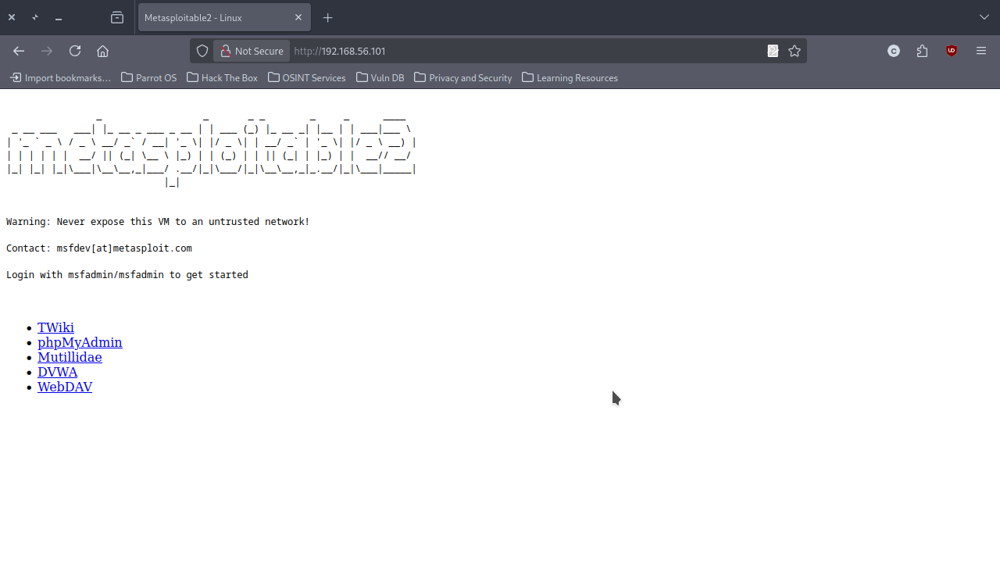
*Metasploitable default page showing available applications*

**Discovered Applications:**
- TWiki - Collaboration platform
- phpMyAdmin - MySQL database management
- Mutillidae - Deliberately vulnerable web application
- DVWA - Damn Vulnerable Web Application
- WebDAV - Web-based Distributed Authoring and Versioning

### Step 3: Directory Enumeration with Gobuster

Performed comprehensive directory brute-forcing to discover hidden paths:

```bash
gobuster dir -u http://192.168.56.101 -w /usr/share/wordlists/dirb/common.txt -x php,bak,txt,old
```

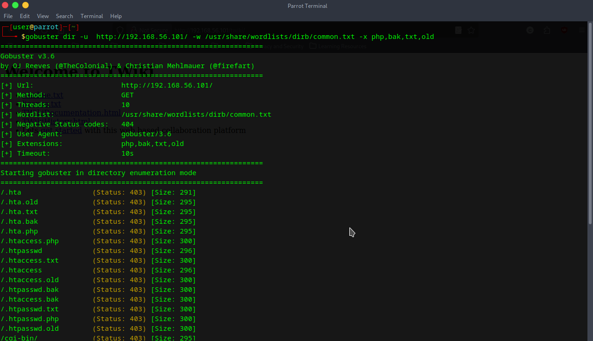
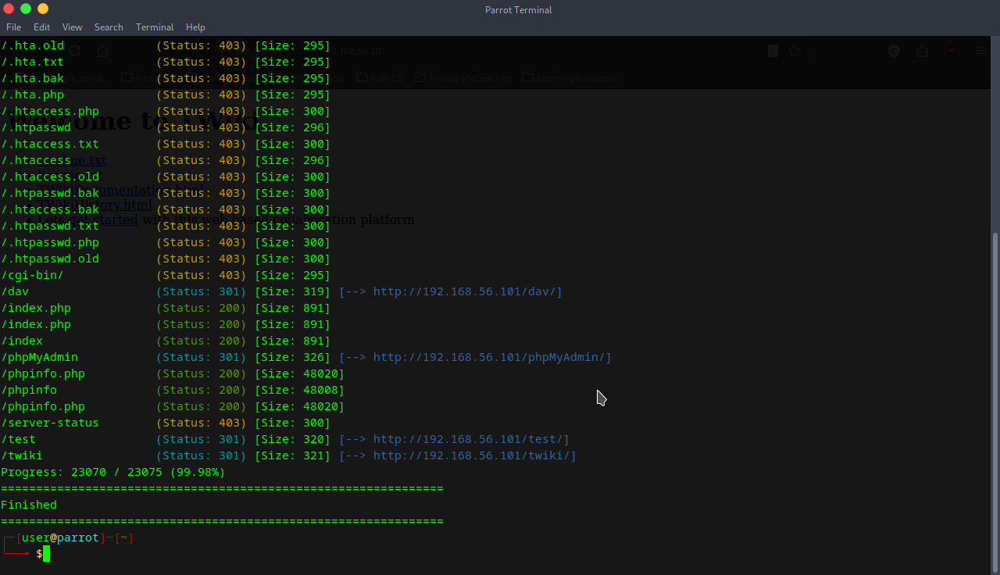
*Directory enumeration revealing exposed paths and applications*

**Critical Discoveries:**
- `/phpMyAdmin/`: MySQL database management interface
- `/twiki/`: Collaboration platform with edit permissions
- `/test/`: Directory indexing enabled
- `/phpinfo.php`: Exposes PHP configuration details
- `/doc/`: Directory listing enabled with Apache documentation
- `/dav/`: WebDAV directory accessible

### Step 4: Comprehensive Vulnerability Scanning with Nikto

Executed detailed web vulnerability assessment:

```bash
nikto -h http://192.168.56.101
```

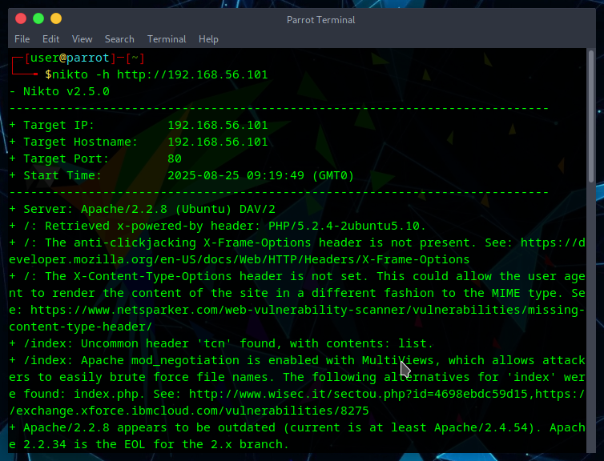
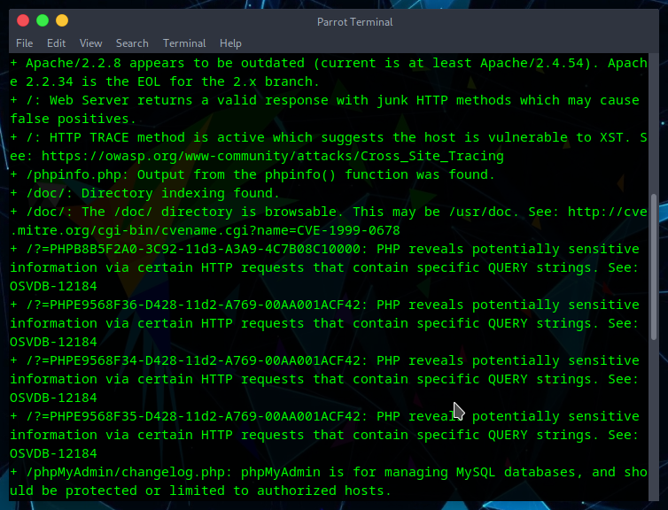
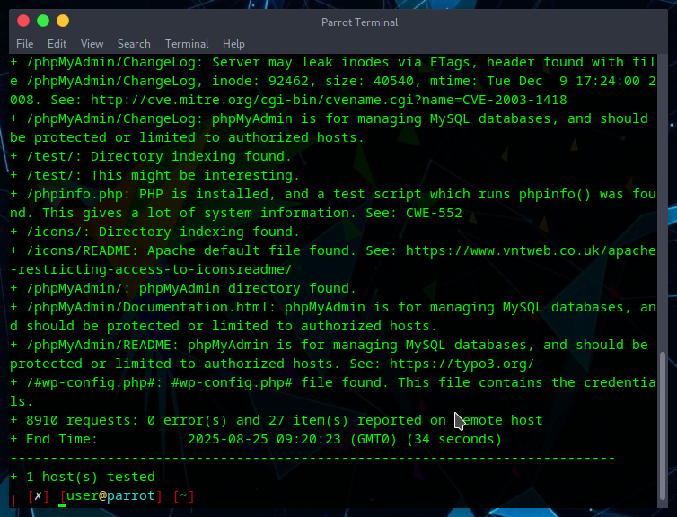
*Nikto scan output highlighting critical security issues*

**Critical Vulnerabilities Identified:**
- Outdated Apache version (2.2.8) with known exploits
- Exposed `phpinfo.php` leaking system configuration
- Directory indexing enabled on multiple directories
- HTTP TRACE method enabled (potential XST attacks)
- Multiple PHP information disclosure vulnerabilities
- Default installations without security hardening

### Step 5: Application-Specific Analysis

#### phpMyAdmin Investigation

Accessed the phpMyAdmin interface for database management analysis:

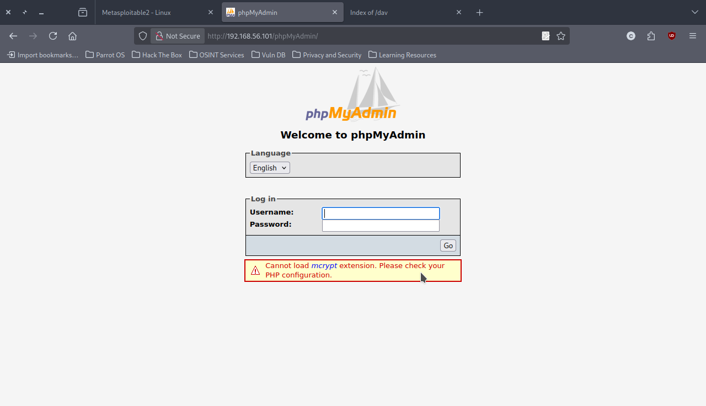
*phpMyAdmin login interface with security warnings*

**Security Issues:**
- Missing mcrypt extension warning displayed
- Default installation with potential weak credentials
- Database management interface exposed to network
- No IP restrictions or access controls implemented

#### TWiki Platform Assessment  

Examined the TWiki collaboration platform:

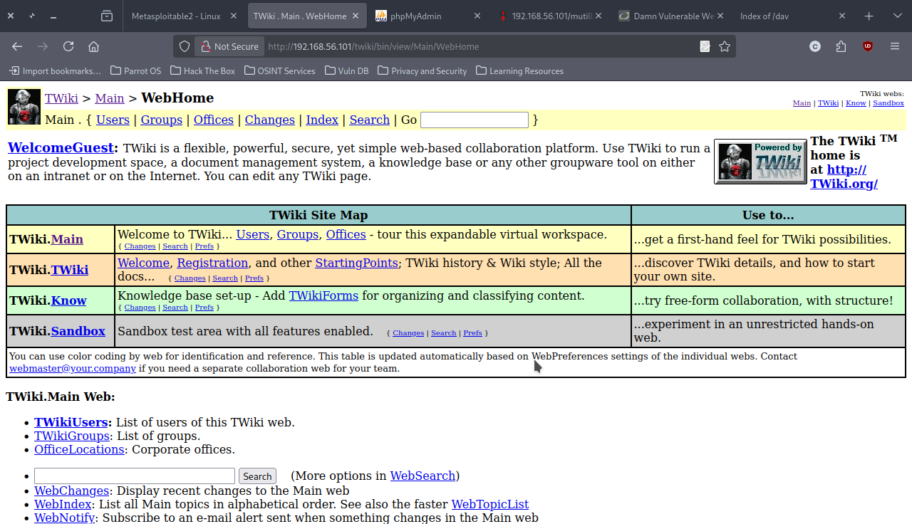
*TWiki web-based collaboration platform interface*

**Findings:**
- Web-based collaboration platform with edit permissions
- Multiple user accounts and groups visible
- Potential for content manipulation and information disclosure
- Default configuration without security hardening

#### Mutillidae Vulnerability Analysis

Discovered the deliberately vulnerable Mutillidae application:

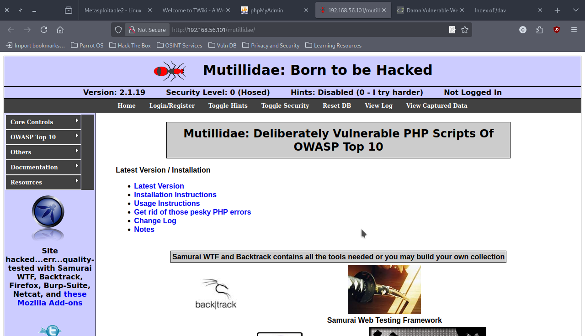
*Mutillidae deliberately vulnerable application interface*

**Critical Security State:**
- Security level set to "0 (Hosed)" - maximum vulnerability
- Version 2.1.19 with all security controls disabled
- Contains OWASP Top 10 vulnerabilities for training
- Should never be exposed on production networks

#### DVWA Security Assessment

Analyzed the Damn Vulnerable Web Application:

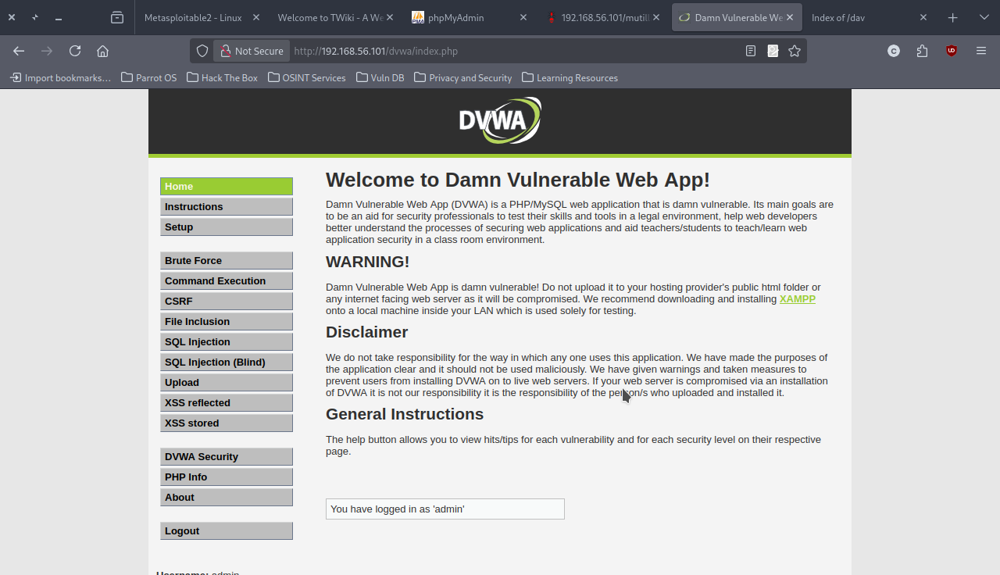
*DVWA login interface and security warnings*

**Security Implications:**
- Deliberately vulnerable PHP/MySQL application
- Default credentials likely still active (`admin/password`)
- Multiple vulnerability categories available for exploitation
- Contains SQL injection, XSS, and other web application flaws

### Step 6: Information Disclosure Analysis

#### phpinfo.php Exposure

Detailed analysis of the exposed PHP configuration:

**Critical Information Disclosed:**
- PHP Version: 5.2.4-2ubuntu5.10 (severely outdated)
- System details: Linux metasploitable 2.6.24-16-server
- Full path disclosure: `/var/www/` document root
- MySQL socket information: `/var/run/mysqld/mysqld.sock`
- `allow_url_fopen` enabled (Remote File Inclusion risk)
- Complete PHP extension and configuration details

*phpinfo.php revealing sensitive server configuration*

---

## Critical Security Findings

| **Vulnerability** | **Risk Level** | **CVSS** | **Description** |
|-------------------|----------------|----------|-----------------|
| **Apache 2.2.8** | 🔴 Critical | 9.3 | Outdated version with multiple known exploits (CVE-2011-3192, CVE-2012-0883) |
| **phpinfo.php Exposure** | 🔴 Critical | 7.5 | Complete system information disclosure |
| **Directory Listing** | 🟡 Medium | 5.3 | Exposes file structure and sensitive documents |
| **Vulnerable Applications** | 🔴 Critical | 9.8 | DVWA, Mutillidae with maximum vulnerability settings |
| **HTTP TRACE Method** | 🟡 Medium | 4.3 | Potential Cross-Site Tracing (XST) attacks |
| **WebDAV Enabled** | 🟠 High | 6.5 | Potential file upload and manipulation |
| **PHP 5.2.4** | 🔴 Critical | 9.0 | End-of-life version with unpatched vulnerabilities |

---

## Attack Surface Analysis

### Immediate Exploitation Vectors

1. **Web Application Attacks:**
   - DVWA: SQL injection, XSS, CSRF, file upload
   - Mutillidae: Complete OWASP Top 10 vulnerabilities
   - phpMyAdmin: Database access, potential privilege escalation

2. **Information Gathering:**
   - phpinfo.php: System reconnaissance and attack planning
   - Directory listings: File structure mapping
   - Error messages: Technology stack identification

3. **Protocol-Level Attacks:**
   - HTTP TRACE: Cross-site tracing attacks
   - WebDAV: File manipulation and upload attacks

### Privilege Escalation Pathways

- Database access through phpMyAdmin could lead to system-level compromise
- File upload capabilities in vulnerable applications
- WebDAV write permissions for malicious file uploads
- PHP configuration allows dangerous functions

---

## Technical Recommendations

### Immediate Security Actions

1. **Remove Information Disclosure:**
   ```bash
   rm /var/www/phpinfo.php
   echo "Options -Indexes" >> /var/www/.htaccess
   ```

2. **Disable Dangerous Methods:**
   ```apache
   <Location "/">
       <LimitExcept GET POST>
           Deny from all
       </LimitExcept>
   </Location>
   ```

3. **Secure Web Applications:**
   - Remove or restrict access to DVWA and Mutillidae
   - Implement IP restrictions for phpMyAdmin
   - Change default credentials for all applications

### Long-term Security Improvements

1. **Software Updates:**
   ```bash
   # Upgrade Apache to supported version
   sudo apt-get update && sudo apt-get upgrade apache2
   
   # Update PHP to supported version
   sudo apt-get install php7.4 php7.4-mysql
   ```

2. **Security Hardening:**
   - Implement Web Application Firewall (WAF)
   - Configure proper SSL/TLS certificates
   - Enable security headers (HSTS, CSP, X-Frame-Options)
   - Regular security scanning and monitoring

3. **Access Controls:**
   - Implement network segmentation
   - Configure proper authentication and authorization
   - Enable comprehensive logging and monitoring

---

## Reconnaissance Lessons Learned

### Intelligence Gathering Techniques
- **Automated Tools**: Nmap, Nikto, and Gobuster provide comprehensive baseline assessment
- **Manual Verification**: Direct application testing reveals additional context
- **Information Correlation**: Combining multiple data sources provides complete attack surface mapping

### Common Misconfigurations
- **Default Installations**: Many applications installed with default, insecure settings
- **Information Disclosure**: Development and debugging features left enabled in production
- **Unnecessary Services**: Multiple attack vectors through unused or poorly configured services

### Defensive Strategies
- **Regular Assessments**: Continuous security scanning and evaluation
- **Hardening Checklists**: Systematic security configuration management
- **Monitoring Implementation**: Real-time detection and alerting systems

---

## Campaign Progress

**Day 6 of 20 Complete** ✅
- Previous: DistCC daemon exploitation (Day 5)
- Current: Apache web services reconnaissance (Day 6)  
- Next: [Target TBD] (Day 7)

**Reconnaissance Phase Summary:**
- **Services Identified**: 5+ web applications
- **Vulnerabilities Found**: 15+ critical and high-risk issues
- **Attack Vectors**: Multiple immediate exploitation paths
- **Intelligence Gathered**: Complete system configuration details

---

## References and Further Reading

- [CVE-2011-3192 (Apache)](https://nvd.nist.gov/vuln/detail/CVE-2011-3192)
- [OWASP Web Security Testing Guide](https://owasp.org/www-project-web-security-testing-guide/)
- [Apache Security Configuration Guide](https://httpd.apache.org/docs/2.4/misc/security_tips.html)
- [NIST Cybersecurity Framework](https://www.nist.gov/cyberframework)

---

> **Ethical Note**: This reconnaissance was conducted in an isolated lab environment for educational purposes. Always obtain proper authorization before testing any system.

**Author:** [CYB3RLEO]  
**Lab Environment:** Metasploitable 2 vs Parrot OS   

---

```
© 2025 - Educational Penetration Testing Lab Series
Part of 20-Day Advanced Security Assessment Campaign
Focus: Web Application Security and Reconnaissance Methodologies
```
